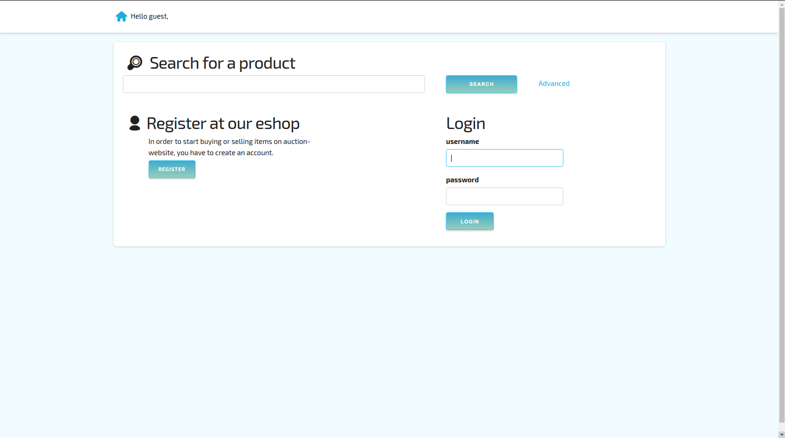
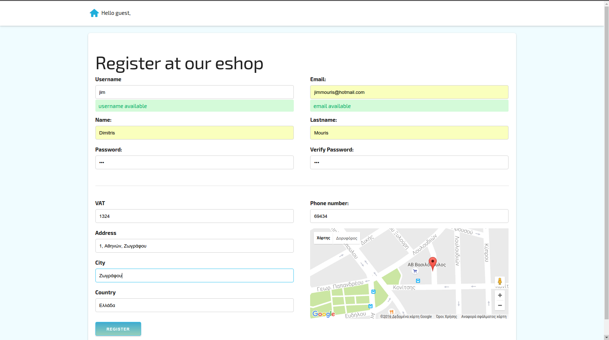
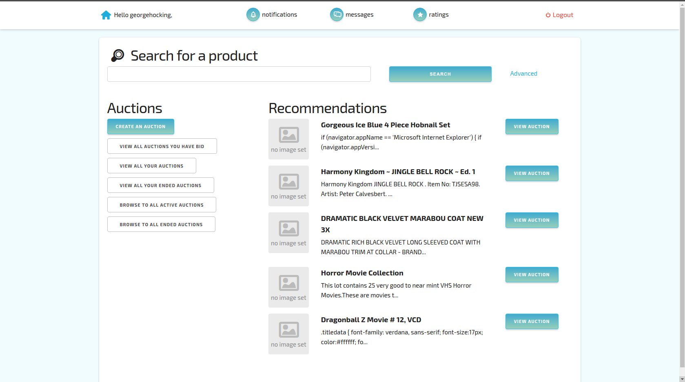
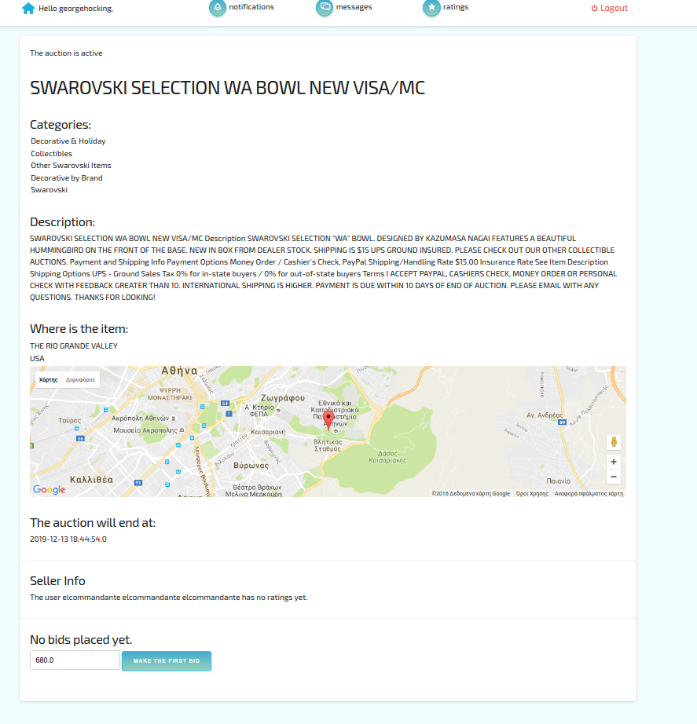
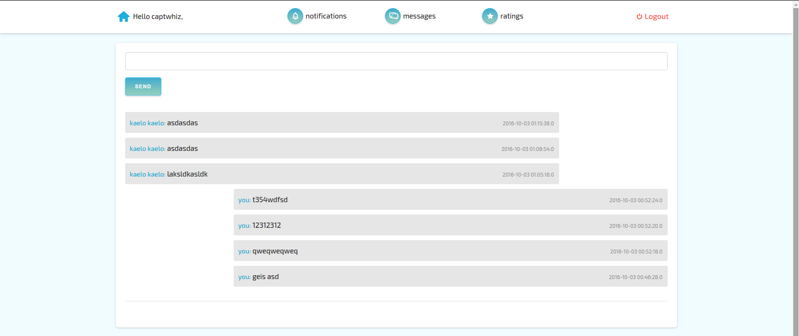
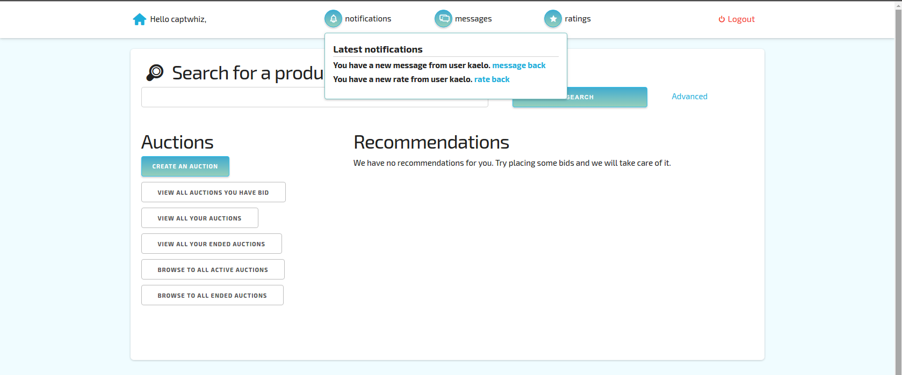
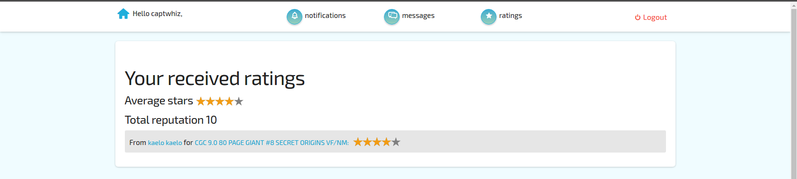
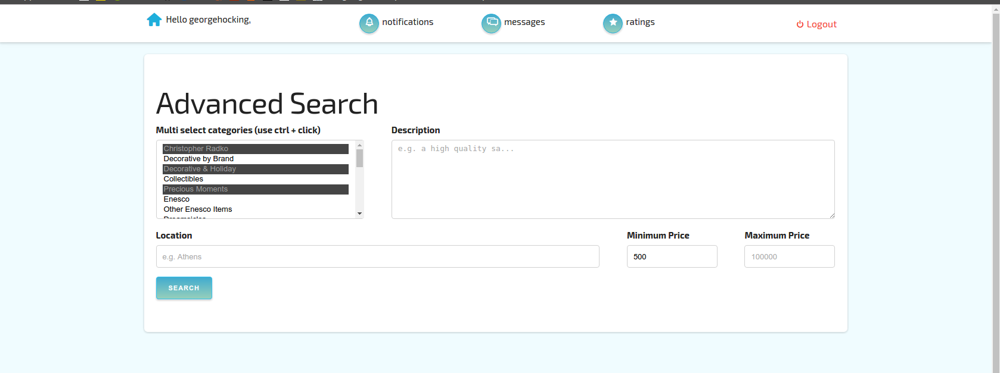
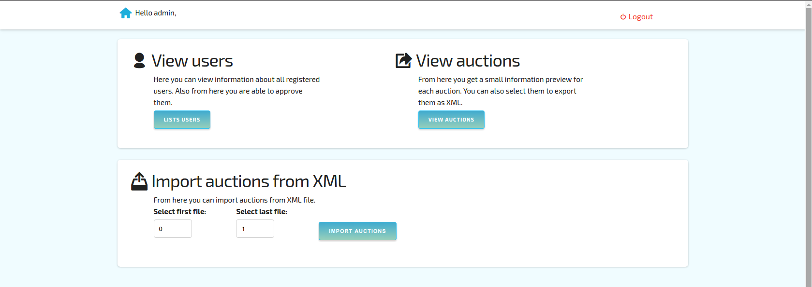

## Auction Webite [![License MIT][badge-license]](LICENSE)
An auction website template developed for the undergraduate course "Technologies for Web Applications" of [Dept. Informatics & Telecommunications](http://www.di.uoa.gr/eng) of [University of Athens](http://en.uoa.gr/).

You can find more screenshots [here](screenshots/)

##### Authors:
+ [John Mulama](https://github.com/JOHNMULAMA)

July 2023

